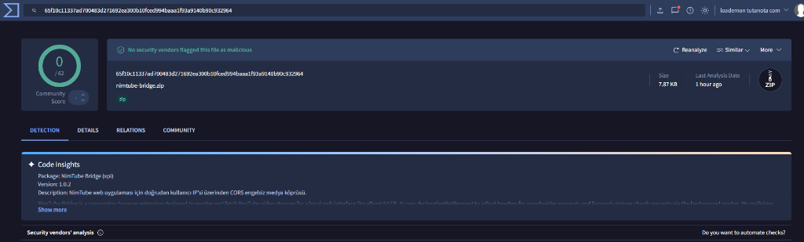

# NimTube — Pure Client-Side YouTube Studio & Downloader

[](https://nimtube.2615.us/)
[](https://www.virustotal.com/gui/file/99f78668f33905a8677161c73ddc7356c63cb24468c7547182ae649bb7673915/detection)
[](LICENSE)

> 🌐 **Canlı Web Sitesi (Live Site):** [https://nimtube.2615.us/](https://nimtube.2615.us/)  
> **NimTube**, YouTube videolarını ve ses akışlarını harici bir sunucuya ihtiyaç duymadan, doğrudan kendi tarayıcınız ve internet bağlantınız üzerinden en yüksek kalitede (4K, 1080p, MP3) indirmenizi sağlayan istemci taraflı (client-side) açık kaynaklı bir medya aracıdır.

---

## Öne Çıkan Özellikler

- **Sıfır Sunucu Bant Genişliği:** İndirme işlemleri merkezi bir sunucu üzerinden değil, doğrudan kendi internet bağlantınız üzerinden yürütülür.
- **Doğrudan Tarayıcı İndirmesi (Direct Native Fetch):** Eklenti destekli yerel C++ soket havuzuyla YouTube CDN'lerinden sıfır IPC/Base64 gecikmesiyle doğrudan indirme (100+ MB/s).
- **Mediabunny ile Saf JavaScript/WASM Kayıpsız Birleştirme:** 1080p, 2K ve 4K çözünürlüklerdeki ayrı görüntü ve ses akışları, 64-bit `mediabunny` motoru (ve WebAssembly FFmpeg yedeği) ile yeniden kodlama olmadan (`passthrough`) milisaniyeler içinde MP4 konteynerine paketlenir.
- **YouTube Oynatıcı İzolasyonu:** Declarative Net Request kurallarında `excludedInitiatorDomains` kullanılarak YouTube'un kendi iç oynatıcısının (`credentials: include`) ve video izleme deneyiminin bozulması %100 engellenir.
- **Doğrudan Diske Akış:** File System Access API kullanılarak indirilen parçalar anlık olarak diske yazılır; multi-gigabayt 4K dosyalarda bile tarayıcı belleği (RAM) 50 MB altında sabit kalır.
- **YouTube Sağ Tık Entegrasyonu:** Eklenti sayesinde YouTube'da izlediğiniz herhangi bir videoya sağ tıklayarak doğrudan "NimTube ile İndir" seçeneğiyle indirme başlatabilirsiniz.

---

## Mimari

```text
[ Tarayıcı Web Arayüzü ]
        │
        ▼ (window.postMessage)
[ NimTube Bridge Eklentisi (Manifest V3) ] ──► [ YouTube Innertube API ]
        │                                          (VisionOS el sıkışması ve doğrudan CDN adresleri)
        ▼
[ 3 Kademeli İndirme Hattı ]
  ├── 1. Direct Native Fetch (Yerel soket havuzu, 100+ MB/s)
  ├── 2. Eklenti Turbo Batch (DASH canlı/sekanslı akışlar)
  └── 3. Paralel Range Worker Havuzu (8 MB dilimler, proxy desteği)
        │
        ▼ (Ham Bayt Tamponları)
[ Mediabunny Muxer (Birincil) / WebAssembly FFmpeg (Yedek) ]
        │ (Yeniden kodlama yok, kayıpsız passthrough MP4/WebM)
        ▼
[ File System Access API ] ──► [ Kullanıcının Diski ]
```

---

## Kurulum ve Geliştirme

### Gereksinimler
- Node.js 18+
- npm veya pnpm

### Projeyi Çalıştırma
```bash
# Bağımlılıkları yükleyin
npm install

# Geliştirme sunucusunu başlatın
npm run dev

# Üretim derlemesi ve eklenti paketleme
npm run build

# Yerel VirusTotal hash ve güvenlik doğrulaması
npm run verify:virustotal
```

---

## NimTube Bridge Eklenti Kurulumu

YouTube indirme araçları Google'ın mağaza politikaları gereği Chrome Web Mağazası'nda yer alamaz. Bu nedenle eklenti açık kaynak olarak yerel kurulur:

1. `public/nimtube-bridge.zip` dosyasını indirin ve bir klasöre çıkartın.
2. Chromium tabanlı tarayıcınızda (Chrome, Edge, Brave, Opera) `chrome://extensions` adresini açın.
3. Sağ üst köşedeki **Geliştirici Modu** (Developer mode) anahtarını açın.
4. Sol üstteki **Paketlenmemiş öğe yükle** butonuna tıklayıp çıkarttığınız `nimtube-bridge` klasörünü seçin.

---

## Güvenlik ve Gizlilik

[](https://www.virustotal.com/gui/file/99f78668f33905a8677161c73ddc7356c63cb24468c7547182ae649bb7673915/detection)

- **Otomatik CI/CD Güvenlik Doğrulaması:** GitHub Actions (`.github/workflows/ci.yml`), her kod değişiminde eklenti zip'ini derler, SHA-256 hash'ini hesaplar ve VirusTotal API v3 (`/api/v3/files/{id}`) üzerinden otomatik olarak tarama sonucunu teyit eder. [Resmi VirusTotal Raporunu İncele](https://www.virustotal.com/gui/file/99f78668f33905a8677161c73ddc7356c63cb24468c7547182ae649bb7673915/detection).
- Eklenti yalnızca `*.youtube.com` ve `*.googlevideo.com` alan adlarına erişim izni ister.
- Tarayıcı geçmişinize, çerezlerinize, şifrelerinize veya diğer sekmelerinize kesinlikle erişmez.
- Hiçbir analitik, telemetri veya üçüncü parti izleyici içermez.

---

## Lisans

Bu proje [MIT Lisansı](LICENSE) altında açık kaynak olarak lisanslanmıştır.
