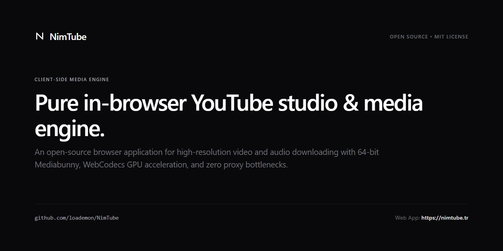
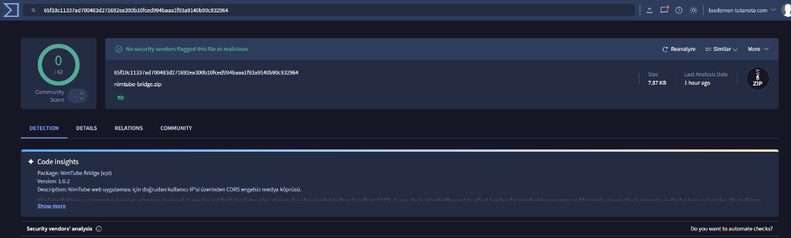

<p align="center">
  <a href="https://nimtube.tr/">
    
  </a>
</p>

# NimTube — Pure Client-Side Video & Audio Downloader

[](https://nimtube.tr/)
[](https://nimtube.tr/?view=releases)
[](https://www.virustotal.com/gui/file/9a06f5a6189d2829cdf25206570618fceef6ef022219f6d0f920594b1b644342/detection)
[](LICENSE)
[](https://www.typescriptlang.org/)
[](https://react.dev/)

> 🌐 **Canlı Web Sitesi (Live Site):** [https://nimtube.tr/](https://nimtube.tr/)  
> **NimTube**, YouTube ve LinkedIn videolarını, canlı yayınlarını ve ses akışlarını harici bir sunucuya ihtiyaç duymadan, doğrudan kendi tarayıcınız ve internet bağlantınız üzerinden en yüksek kalitede (4K, 1080p, MP3) indirmenizi sağlayan istemci taraflı (client-side) açık kaynaklı bir medya aracıdır.

---

## Öne Çıkan Özellikler

- **Sıfır Sunucu Bant Genişliği:** İndirme işlemleri merkezi bir sunucu üzerinden değil, doğrudan kendi internet bağlantınız üzerinden yürütülür.
- **Çoklu Platform Desteği (YouTube & LinkedIn):** YouTube videoları, Shorts, LinkedIn feed videoları ve LinkedIn etkinlik canlı yayınları (Theater / Broadcast) doğrudan desteklenir.
- **Evrensel HLS Motoru (RFC 8216):** Ayrık ses parçaları (`#EXT-X-MEDIA`), Web Crypto Subtle ile donanım hızlandırmalı AES-128 şifre çözme ve kesintisiz video-ses birleştirme.
- **Doğrudan Tarayıcı İndirmesi (Direct Native Fetch):** Eklenti destekli yerel C++ soket havuzuyla YouTube & LinkedIn CDN'lerinden sıfır IPC/Base64 gecikmesiyle doğrudan indirme (100+ MB/s).
- **Mediabunny ile Saf JavaScript Kayıpsız Birleştirme:** Ayrı görüntü ve ses akışları, 64-bit `mediabunny` motoru ve WebCodecs GPU donanım hızlandırması ile yeniden kodlama olmadan (`passthrough`) milisaniyeler içinde MP4 konteynerine paketlenir.
- **Oynatıcı ve Oturum İzolasyonu:** Platform sitelerindeki normal video izleme deneyiminize ve oturum çerezlerinize asla müdahale edilmez.
- **Doğrudan Diske Akış:** File System Access API kullanılarak indirilen parçalar anlık olarak diske yazılır; multi-gigabayt 4K dosyalarda bile tarayıcı belleği (RAM) 50 MB altında sabit kalır.
- **Platform Sağ Tık Menü Entegrasyonu:** YouTube ve LinkedIn sayfalarında videolara sağ tıklayarak doğrudan tek tıkla indirme başlatabilirsiniz.

---

## Mimari

```text
[ Tarayıcı Web Arayüzü ]
        │
        ▼ (window.postMessage)
[ NimTube Bridge Eklentisi (Manifest V3) ] ──► [ YouTube Innertube API ]
        │                                          (VisionOS el sıkışması ve doğrudan CDN adresleri)
        ▼
[ 3 Kademeli İndirme Hattı ]
  ├── 1. Direct Native Fetch (Yerel soket havuzu, 100+ MB/s)
  ├── 2. Eklenti Turbo Batch (DASH canlı/sekanslı akışlar)
  └── 3. Paralel Range Worker Havuzu (8 MB dilimler, proxy desteği)
        │
        ▼ (Ham Bayt Tamponları)
[ Mediabunny 64-bit Muxer & WebCodecs GPU ]
        │ (Yeniden kodlama yok, kayıpsız passthrough MP4/WebM)
        ▼
[ File System Access API ] ──► [ Kullanıcının Diski ]
```

---

## 🗺️ Yol Haritası & Gelecek Planları (Roadmap / TODO)

NimTube'un **%100 sunucusuz (pure client-side)** ve **tamamen yerel veri gizliliği** mimarisini koruyarak hayata geçirilmesi planlanan teknik geliştirmeler:

### 🎬 1. Gelişmiş Medya İşleme (Core Media Processing)
- [ ] **İstemci Taraflı Video Kırpma & Kesme (Client-Side Clipping):**
  - **Teknik Detay:** Kullanıcının indirme öncesinde görsel zaman kaydırıcı (timeline slider) ile başlangıç ve bitiş saniyelerini seçebilmesi.
  - **Mimari:** 64-bit `mediabunny` motorunun `trim: { start, end }` kabiliyeti ve WebCodecs GPU altyapısıyla tüm video yerine yalnızca seçilen parçanın indirilip kayıpsız (passthrough) mühürlenmesi.
- [ ] **Kapsamlı Altyazı Desteği (Subtitles - Softsub & Hardsub):**
  - **Teknik Detay:** YouTube ve LinkedIn üzerindeki resmi/otomatik VTT ve SRT altyazı akışlarının ayrıştırılması.
  - **Mimari:** Kullanıcıya tek tıkla `.srt` dosyası olarak ayrı indirme veya `mediabunny` muxer aşamasında MP4 konteyneri içine gömülü (softsub subtitle track) olarak ekleme opsiyonu.
- [ ] **Gelişmiş Ses Kodlama Motoru & Format Seçimi (Audio Converter):**
  - **Teknik Detay:** Sadece ses indirirken doğrudan 320kbps MP3, FLAC, WAV veya OGG formatı ve hedef bitrate seçimi.
  - **Mimari:** WebAssembly / WebCodecs tabanlı ses kodlayıcı entegrasyonu ile sunucuya ihtiyaç duymadan doğrudan tarayıcı belleğinde dönüştürme.

### 🌐 2. Çoklu Platform Genişletmeleri (Multi-Platform Bridges)
- [ ] **Instagram Reels & Post İndirme:**
  - **Teknik Detay:** Instagram Reels ve gönderi videolarının tek tıkla en yüksek çözünürlükte indirilmesi.
  - **Mimari:** `NimTube Bridge` DNR kurallarına Instagram CDN (`*.cdninstagram.com`, `*.fbcdn.net`) tünelleri eklenerek tarayıcı üzerinden doğrudan çekim.
- [ ] **X (Twitter) Video & Canlı Yayın Desteği:**
  - **Teknik Detay:** X üzerindeki dinamik video tweet'leri ve Spaces kayıtlarının çözümlenmesi.
  - **Mimari:** LinkedIn için geliştirdiğimiz RFC 8216 HLS motoru genişletilerek m3u8 adaptif akışlarının doğrudan istemcide birleştirilmesi.
- [ ] **TikTok Video İndirme (Filigransız / HD):**
  - **Teknik Detay:** TikTok CDN akışlarının tespit edilerek filigransız MP4 formatında kaydedilmesi.

### 📋 3. Arayüz & İndirme Yönetimi (UI / UX & Download Management)
- [ ] **Oynatma Listesi & Toplu İndirme Kuyruğu (Playlist & Batch Queue):**
  - **Teknik Detay:** YouTube oynatma listesi URL'si girildiğinde tüm listenin taranarak toplu indirme kuyruğuna alınması.
  - **Mimari:** İstemci tarafında çalışan akıllı `Adaptive Concurrency Pool` ile ağ kotasını tüketmeden videoların sırayla veya 2'şerli paralel gruplarla diske akıtılması.
- [ ] **Kalıcı İndirme Çekmecesi (Persistent Download Drawer):**
  - **Teknik Detay:** Kullanıcı sayfada gezinirken veya yeni bağlantılar aratırken alt tarafta küçülebilen (minimize olan) YouTube tarzı indirme çubuğu.
  - **Mimari:** Sayfalar arası geçişlerde arka plan Web Worker indirme durumunu kesintisiz koruyan React state/store mimarisi.

### 📡 4. Ağ & Cihazlar Arası Ekosistem (Network & Device Ecosystem)
- [ ] **Yerel Ağa / Telefona Aktarım (Local P2P / Wi-Fi QR Transfer):**
  - **Teknik Detay:** Bilgisayara inen videonun, telefondan taranacak tek bir QR kod ile yerel Wi-Fi üzerinden internet harcamadan doğrudan telefona aktarılması.
  - **Mimari:** WebRTC DataChannel (P2P Local Connection) ile cihazlar arası doğrudan yerel soket aktarımı (sıfır bulut yükü).
- [ ] **Dinamik Bant Genişliği Sınırlayıcı (Bandwidth Throttler):**
  - **Teknik Detay:** Arka planda indirme yapılırken kullanıcının diğer işlerini (oyun, toplantı, yayın) yavaşlatmamak için ayarlanabilir indirme hızı tavanı (örn. 5 MB/s, 10 MB/s).

---

## Kurulum ve Geliştirme

### Gereksinimler
- Node.js 18+
- npm veya pnpm

### Projeyi Çalıştırma
```bash
# Bağımlılıkları yükleyin
npm install

# Geliştirme sunucusunu başlatın
npm run dev

# Üretim derlemesi ve eklenti paketleme
npm run build

# Yerel VirusTotal hash ve güvenlik doğrulaması
npm run verify:virustotal
```

---

## NimTube Bridge Eklenti Kurulumu

YouTube indirme araçları Google'ın mağaza politikaları gereği Chrome Web Mağazası'nda yer alamaz. Bu nedenle eklenti açık kaynak olarak yerel kurulur:

1. `public/nimtube-bridge.zip` dosyasını indirin ve bir klasöre çıkartın.
2. Chromium tabanlı tarayıcınızda (Chrome, Edge, Brave, Opera) `chrome://extensions` adresini açın.
3. Sağ üst köşedeki **Geliştirici Modu** (Developer mode) anahtarını açın.
4. Sol üstteki **Paketlenmemiş öğe yükle** butonuna tıklayıp çıkarttığınız `nimtube-bridge` klasörünü seçin.

---

## Güvenlik ve Gizlilik

<<<<<<< HEAD
[](https://www.virustotal.com/gui/file/9a06f5a6189d2829cdf25206570618fceef6ef022219f6d0f920594b1b644342/detection)

- **Otomatik CI/CD Güvenlik Doğrulaması:** GitHub Actions (`.github/workflows/ci.yml`), her kod değişiminde eklenti zip'ini derler, SHA-256 hash'ini hesaplar ve VirusTotal API v3 (`/api/v3/files/{id}`) üzerinden otomatik olarak tarama sonucunu teyit eder. [Resmi VirusTotal Raporunu İncele](https://www.virustotal.com/gui/file/9a06f5a6189d2829cdf25206570618fceef6ef022219f6d0f920594b1b644342/detection).
=======
[](https://www.virustotal.com/gui/file/9a06f5a6189d2829cdf25206570618fceef6ef022219f6d0f920594b1b644342/detection)

- **Otomatik CI/CD Güvenlik Doğrulaması:** GitHub Actions (`.github/workflows/ci.yml`), her kod değişiminde eklenti zip'ini derler, SHA-256 hash'ini hesaplar ve VirusTotal API v3 (`/api/v3/files/{id}`) üzerinden otomatik olarak tarama sonucunu teyit eder. [Resmi VirusTotal Raporunu İncele](https://www.virustotal.com/gui/file/9a06f5a6189d2829cdf25206570618fceef6ef022219f6d0f920594b1b644342/detection).
>>>>>>> e1a7547 (docs: add detailed roadmap and future plans to README)
- Eklenti yalnızca `*.youtube.com` ve `*.googlevideo.com` alan adlarına erişim izni ister.
- Tarayıcı geçmişinize, çerezlerinize, şifrelerinize veya diğer sekmelerinize kesinlikle erişmez.
- Hiçbir analitik, telemetri veya üçüncü parti izleyici içermez.

---

## Lisans

Bu proje [MIT Lisansı](LICENSE) altında açık kaynak olarak lisanslanmıştır.
